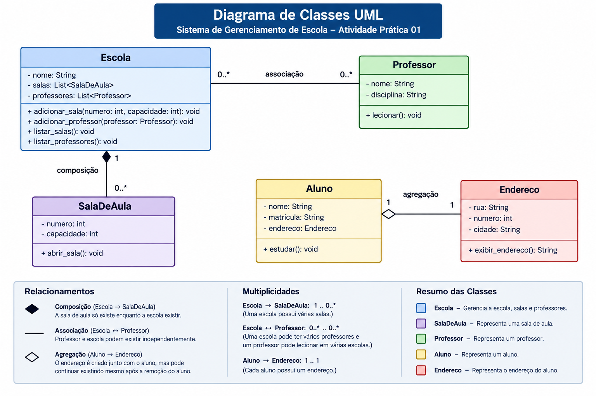

# Atividade Prática 01 - Sistema de Gerenciamento Escolar

## Objetivo

Implementar um sistema utilizando Programação Orientada a Objetos em Python demonstrando os conceitos de:

- Associação
- Agregação
- Composição

## Diagrama UML



## Classes Implementadas

- Escola
- SalaDeAula
- Professor
- Aluno
- Endereco

## Relacionamentos

| Relacionamento | Tipo |
|---------------|------|
| Escola → SalaDeAula | Composição |
| Escola → Professor | Associação |
| Aluno → Endereco | Agregação |

## Como executar

```bash
python main.py
```